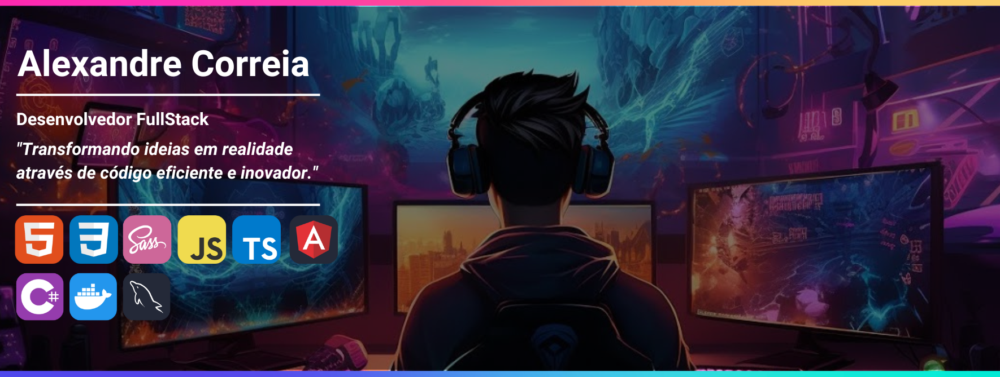

 

  
  

## 💻 Tecnologias e Ferramentas

## 💬 Sobre mim

  Minha jornada na área da tecnologia começou movida pela curiosidade. Depois de ver filmes e séries com hackers fazendo coisas incríveis, quem não ficaria com vontade de tentar entender como tudo isso funciona?

  Comecei a aprender sobre hardware e, ao lado de uma pessoa especial, tive companhia e ajuda para ingressar na ETEC, onde concluí o curso técnico em Informática. Na ETEC, adquiri mais conhecimentos sobre a área e desenvolvi meus primeiros programas. Depois disso, mergulhei no mundo do software, continuando a fazer cursos e praticar com projetos simples até iniciar e concluir a faculdade Impacta, onde me formei em Análise e Desenvolvimento de Sistemas.

  Minhas habilidades principais no front-end incluem HTML, CSS, SASS, JavaScript, TypeScript, Bootstrap e Angular. Já no back-end, utilizo .NET Core com C# (Entity Framework, ASP.NET Core MVC, AutoMapper, Fluent Results, JWT, Swagger), Docker, Nginx e bancos de dados relacionais como SQL Server, MySQL e SQLite.

  Atualmente, trabalho na área como desenvolvedor, corrigindo problemas e bugs tanto no front-end quanto no back-end. Procuro sempre ser uma pessoa educada e respeitosa, além de adorar interagir com novas pessoas e compartilhar minha história. Então, fique à vontade para me enviar uma mensagem caso queira falar sobre tecnologia ou jogos.

  Confira meu [portfólio](https://)!

## ☎️ &nbsp;Contact me

